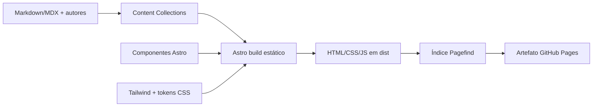

# Design técnico e visual — Blog Techs Community

## 1. Resumo das decisões

| Área              | Escolha                                       | Motivo                                                                                                   |
| ----------------- | --------------------------------------------- | -------------------------------------------------------------------------------------------------------- |
| Gerador do site   | Astro, em modo estático                       | Gera HTML por padrão, aceita Markdown/MDX e possui fluxo oficial para GitHub Pages.                      |
| Linguagem         | TypeScript estrito                            | Segurança de tipos para componentes, configuração e conteúdo.                                            |
| Conteúdo          | Astro Content Collections                     | Schema validado, consultas no build e páginas estáticas tipadas.                                         |
| CSS               | Tailwind CSS via plugin oficial para Vite     | CSS gerado estaticamente, sem runtime, responsivo e orientado por tokens.                                |
| CSS de artigos    | `@tailwindcss/typography`                     | Base consistente para conteúdo Markdown, customizada pelos tokens da marca.                              |
| Componentes de UI | Componentes `.astro` próprios                 | Evita uma biblioteca JavaScript desnecessária e mantém identidade própria.                               |
| Interatividade    | JavaScript/TypeScript nativo em ilhas mínimas | A busca não justifica adotar React, Vue ou outro runtime no MVP.                                         |
| Busca             | Pagefind após o build                         | Índice local e estático, sem serviço externo nem backend.                                                |
| Feeds/SEO         | Integrações oficiais do ecossistema Astro     | Sitemap e RSS são gerados no build a partir da mesma fonte de conteúdo.                                  |
| Testes            | Vitest + Playwright + axe-core                | Cobertura unitária, navegação no artefato real e acessibilidade automatizada.                            |
| Gerenciador       | npm com lockfile versionado                   | Menor barreira para colaboradores e detecção automática no workflow do Astro.                            |
| Deploy            | GitHub Actions + GitHub Pages                 | Build reproduzível, revisão do CI e hospedagem compatível com o repositório.                             |
| Direção visual    | Retrofuturismo editorial distópico            | Traduz a atmosfera de _1984_ para uma linguagem original de imprensa, vigilância e tecnologia analógica. |

As versões exatas devem ser as versões estáveis na implementação e ficar fixadas em
`package-lock.json`. Atualizações maiores exigem execução completa do CI.

### Alternativas consideradas

- **Jekyll:** tem suporte nativo no GitHub Pages, mas Astro oferece experiência de
  componentes, TypeScript e conteúdo tipado sem perder a saída estática.
- **Next.js:** adiciona conceitos de servidor e uma superfície maior de runtime que
  não são necessários para este blog.
- **Bootstrap:** acelera interfaces genéricas, mas dificulta construir uma identidade
  editorial própria e adiciona estilos/componentes não usados.
- **React/Vue/Svelte:** podem ser incorporados pelo Astro no futuro, porém não há
  interação no MVP que compense o JavaScript adicional.

## 2. Arquitetura



O navegador recebe documentos prontos. JavaScript é reservado ao menu móvel e à
busca. Listagens, taxonomias, paginação e artigos são calculados no build. Não
existe API de produção.

## 3. Estrutura proposta

```text
.
├── .github/
│   └── workflows/
│       ├── ci.yml
│       └── deploy.yml
├── public/
│   ├── fonts/
│   ├── images/
│   ├── favicon.svg
│   └── robots.txt
├── scripts/
│   └── validate-content.mjs
├── src/
│   ├── assets/
│   ├── components/
│   │   ├── article/
│   │   ├── layout/
│   │   ├── navigation/
│   │   └── seo/
│   ├── content/
│   │   ├── authors/
│   │   └── blog/
│   ├── layouts/
│   │   ├── BaseLayout.astro
│   │   └── ArticleLayout.astro
│   ├── pages/
│   │   ├── autores/[slug].astro
│   │   ├── blog/index.astro
│   │   ├── blog/pagina/[page].astro
│   │   ├── blog/[slug].astro
│   │   ├── categorias/[slug].astro
│   │   ├── tags/[slug].astro
│   │   ├── 404.astro
│   │   ├── index.astro
│   │   ├── rss.xml.ts
│   │   └── busca.astro
│   ├── styles/
│   │   └── global.css
│   ├── content.config.ts
│   └── consts.ts
├── tests/
│   ├── e2e/
│   └── unit/
├── astro.config.mjs
├── package.json
└── tsconfig.json
```

Rotas institucionais podem ser arquivos `.astro`, `.md` ou `.mdx` em `src/pages`,
conforme a necessidade de composição.

## 4. Modelo de conteúdo

### 4.1 Artigo

Schema conceitual da coleção `blog`:

```ts
type Article = {
  title: string;
  description: string; // entre 80 e 180 caracteres
  publishedAt: Date;
  updatedAt?: Date;
  author: string; // referência a authors
  categories: string[]; // ao menos uma categoria controlada
  tags?: string[];
  cover: ImageMetadata;
  coverAlt: string;
  draft?: boolean; // padrão false
  featured?: boolean; // padrão false; no máximo um destaque efetivo
  canonicalUrl?: string; // apenas quando o original estiver fora do portal
};
```

O nome do arquivo define o slug. O validador deve rejeitar slug duplicado, data
inválida, autor inexistente, categoria desconhecida, imagem ausente e texto
alternativo vazio para imagem informativa. Em produção, somente artigos com
`draft !== true` e `publishedAt <= agora` entram nas consultas.

### 4.2 Autor

```ts
type Author = {
  name: string;
  slug: string;
  bio: string;
  avatar?: ImageMetadata;
  github?: string;
  linkedin?: string;
  website?: string;
};
```

### 4.3 Categorias iniciais

- Desenvolvimento Web
- Mobile
- Dados e IA
- DevOps e Cloud
- Carreira e Comunidade

A categoria é armazenada pelo identificador normalizado e recebe o nome de exibição
por um mapa central. Alterações nesse vocabulário passam por revisão editorial.

## 5. Rotas e navegação

| Rota                           | Renderização    | Observação                                                      |
| ------------------------------ | --------------- | --------------------------------------------------------------- |
| `/`                            | estática        | Destaque, recentes, categorias e chamada para contribuir.       |
| `/blog/` e `/blog/pagina/<n>/` | estática        | Paginação de 12 artigos. A primeira página usa apenas `/blog/`. |
| `/blog/<slug>/`                | estática        | Artigo, sumário, autoria e relacionados.                        |
| `/categorias/<slug>/`          | estática        | Artigos da categoria.                                           |
| `/tags/<slug>/`                | estática        | Artigos da tag normalizada.                                     |
| `/autores/<slug>/`             | estática        | Perfil e artigos publicados.                                    |
| `/busca/`                      | estática + ilha | Interface para o índice Pagefind.                               |
| `/sobre/`                      | estática        | Missão, valores e canais oficiais.                              |
| `/contribua/`                  | estática        | Processo editorial e link para o GitHub.                        |
| `/404.html`                    | estática        | Recuperação com busca e links principais.                       |

Todas as URLs públicas usam barra final para uma política única de canonical. Como
este é um site de organização com o nome especial `techs-community.github.io`, o
Astro deve usar `site: "https://techs-community.github.io"` e não precisa definir
um `base` com subdiretório. Links internos devem ser criados por utilitário central
para não bloquear uma futura migração para domínio próprio.

## 6. Sistema visual

### 6.1 Direção

A interface deve parecer um jornal técnico clandestino produzido dentro de uma
burocracia retrofuturista: papel envelhecido, tinta quase preta, laranja oxidado,
tipografia editorial condensada, diagramas de sistema, terminais CRT, carimbos,
numeração de arquivo e linhas de grade. A referência literária é a atmosfera de
controle, vigilância e tecnologia obsoleta de _1984_.

Essa inspiração deve resultar em uma composição própria. Não se deve reproduzir
capa de edição, ilustração, retrato, slogan, lettering ou layout associado a uma
adaptação existente. Também não se deve fabricar uma interface ilegível apenas para
parecer “antiga”: o conteúdo técnico continua sendo a prioridade.

Princípios visuais:

- **arquivo, não nostalgia decorativa:** metadados parecem fichas catalográficas e
  registros de sistema porque organizam informação real;
- **analógico + computacional:** texturas de impressão convivem com diagramas,
  endereços de rede, cursores e blocos de código;
- **tensão controlada:** assimetria, tarjas e carimbos criam caráter, enquanto a
  grade, os espaços e a tipografia mantêm a leitura previsível;
- **cor como sinal:** o laranja marca chamadas, status e foco, não grandes massas
  arbitrárias;
- **efeito progressivo:** sem CSS avançado ou JavaScript, o site continua claro,
  navegável e semanticamente completo.

### 6.2 Ativo oficial da comunidade

A fonte canônica da marca é
[`techs-community/.github/profile/assets/logo.png`](https://github.com/techs-community/.github/blob/main/profile/assets/logo.png),
e a organização oficial é
[`github.com/techs-community`](https://github.com/techs-community).

O arquivo de referência é uma arte quadrada de 1254 x 1254 px, RGB e sem canal alfa.
Visualmente, combina três figuras em trajes formais com computadores/terminais no
lugar da cabeça, diagramas técnicos, código, textura de papel, preto e cinzas, além
de um círculo laranja. Ele já define a ponte entre retrofuturismo, vigilância e
comunidade técnica e deve orientar, sem ser redesenhado, o restante do sistema.

Regras de uso:

- preservar sempre a proporção 1:1 e disponibilizar texto alternativo contextual;
- não recolorir, espelhar, redesenhar, remover elementos ou sobrepor texto à arte;
- usar a imagem completa em destaque institucional, Sobre e/ou hero, onde exista
  espaço para seus detalhes; evitar reduzi-la a um ícone ilegível;
- sobre fundos, manter uma margem de respiro mínima equivalente a 5% da largura;
- gerar cópias otimizadas e responsivas no build a partir do arquivo oficial, sem
  alterar o original versionado;
- confirmar licença e autorização de uso antes da publicação; a presença no
  repositório oficial não substitui documentação de direitos;
- não inventar uma versão compacta. Enquanto não houver símbolo oficial aprovado,
  header e favicon usam um wordmark tipográfico “TECHS COMMUNITY” claramente
  separado da arte principal.

### 6.3 Tokens

Tokens semânticos ficam em variáveis CSS e são expostos ao Tailwind. Valores finais
podem ser refinados durante a implementação, preservando estes papéis:

```css
:root {
  --color-bg: #e7e0d2;
  --color-surface: #f1eadc;
  --color-text: #1b1b18;
  --color-muted: #5d5a52;
  --color-border: #34332e;
  --color-brand: #c86f16;
  --color-brand-strong: #9f4e0b;
  --color-brand-contrast: #171713;
  --color-alert: #8f2721;
  --color-focus: #005fcc;
  --radius-sm: 0;
  --radius-md: 0.125rem;
  --radius-lg: 0.25rem;
  --content-width: 72rem;
  --reading-width: 45rem;
}
```

Os valores partem das cores percebidas na arte oficial, mas devem ser confirmados
por amostragem do arquivo-fonte e ajustados para contraste. A interface usa somente
o tema claro de papel envelhecido, tinta quase preta e laranja como sinal. O azul de
foco é deliberadamente distinto da marca e deve permanecer visível nesse tema.

### 6.4 Tipografia e espaçamento

- Títulos e wordmark: família condensada, pesada e de inspiração editorial/industrial,
  com licença aberta e arquivos hospedados no próprio site; antes da seleção final,
  usar fallback `Arial Narrow`, `Roboto Condensed`, `sans-serif`.
- Corpo: serifada editorial altamente legível ou sans humanista, escolhida por
  testes de leitura; manter fallback de sistema e evitar aparência de documento
  datilografado em parágrafos longos.
- Metadados, labels e código: monoespaçada de alta legibilidade, em caixa alta apenas
  para trechos curtos.
- Corpo de artigo: 1rem no mobile, chegando a 1.125rem em telas maiores, com
  entrelinha mínima de 1.65.
- Escala de espaçamento baseada em múltiplos de 4 px.
- Linha de leitura limitada por `--reading-width` e por cerca de 65–75 caracteres.
- Fontes finais devem ter licença registrada, subconjuntos WOFF2 e hospedagem local;
  nenhuma chamada a Google Fonts ou CDN é necessária.

### 6.5 Composição e iconografia

- Grade editorial de 12 colunas no desktop e 4 no mobile, com algumas quebras de
  alinhamento apenas em destaques.
- Bordas de 1–2 px, cantos quase retos, sombras duras raras e sem glassmorphism.
- Cards recebem identificador, data ou categoria como metadado de arquivo; não
  adicionar números sem significado.
- Tarjas, sublinhados e carimbos devem ser texto real quando comunicarem estado.
- Ícones devem ser geométricos, monocromáticos e compreensíveis sem textura.
- Diagramas e detalhes técnicos são ornamentais quando não carregam dados e, nesse
  caso, devem ser ignorados por tecnologia assistiva.
- Granulação de papel deve ser leve, sem animação e preferencialmente produzida por
  um asset pequeno ou CSS; nunca aplicar ruído por cima do corpo do artigo.
- Animações, quando existirem, lembram cursor, varredura ou impressão e duram pouco;
  ficam completamente desativadas com `prefers-reduced-motion`.

### 6.6 Componentes

Componentes mínimos do MVP:

- `Header`, `MobileMenu`, `Footer` e `SkipLink`;
- `ArticleCard`, `FeaturedArticle`, `ArticleMeta`, `AuthorCard` e `TagList`;
- `Pagination`, `Breadcrumbs`, `TableOfContents` e `Search`;
- `SeoHead`, `SocialImage`, `CodeBlock` e estados vazio/erro.

Estados interativos devem incluir padrão, hover, foco visível, ativo e desabilitado
quando aplicável. Componentes interativos devem conservar alvo mínimo de 44 x 44 px.

### 6.7 Aplicação por página

- **Home:** composição mais expressiva, com a arte oficial em destaque, manchete
  editorial, “número da edição” derivado da data e cards tratados como registros.
- **Artigo:** reduz ruído e assimetria; mantém cabeçalho de arquivo, régua, metadados
  monoespaçados e pequenos acentos laranja fora da coluna de leitura.
- **Listagens:** lembram índice/catalogação, com hierarquia forte e filtros claros.
- **Sobre:** apresenta a arte integral, missão e link destacado para a organização.
- **404:** usa linguagem de “registro não localizado”, sem esconder a explicação
  humana nem os caminhos de recuperação.
- **Busca:** lembra um terminal apenas visualmente; campo, labels e resultados seguem
  padrões web reconhecíveis e não simulam uma linha de comando obrigatória.

## 7. Estratégia de CSS

- Tailwind será integrado pelo plugin oficial `@tailwindcss/vite`.
- `src/styles/global.css` importa Tailwind, registra os tokens do tema claro,
  estilos de base e ajustes do plugin Typography.
- Utilitários ficam próximos do markup; padrões repetidos viram componentes Astro.
- Não usar `@apply` como mecanismo geral de abstração.
- Valores arbitrários só são aceitos quando não representam um token reutilizável.
- CSS de componente fica scoped no próprio `.astro` apenas para casos que não sejam
  bem expressos por tokens/utilitários.
- Não adicionar Bootstrap, Material UI ou biblioteca equivalente em paralelo.
- Efeitos retro devem ser implementados sobre CSS semântico e assets otimizados;
  não introduzir um segundo framework ou runtime visual para produzi-los.

## 8. Imagens e conteúdo rico

- Capas versionadas em `src/assets` para otimização no build.
- Assets que precisam manter nome público, como favicon, ficam em `public`.
- A arte oficial deve ser obtida da fonte canônica, registrada com sua origem e
  processada pelo pipeline de imagens; não usar hotlink para o GitHub em produção.
- Largura e altura devem ser conhecidas para evitar layout shift.
- Capas usam proporção editorial única de 16:9 e variantes responsivas.
- Blocos de código devem ter destaque de sintaxe no build, rótulo de linguagem e
  botão de copiar progressivamente aprimorado.
- MDX pode compor somente componentes previamente permitidos; artigos não devem
  importar scripts arbitrários.

## 9. SEO, feed e dados estruturados

`SeoHead` é a única fonte para canonical, robots, Open Graph e Twitter Card. Ele
recebe dados do artigo ou defaults globais. A imagem social padrão deve ter
1200 x 630 px. Artigos geram JSON-LD `BlogPosting`, incluindo autor, datas,
headline, description, image e publisher.

O RSS inclui título, resumo, URL, data e conteúdo ou trecho sanitizado dos artigos.
Sitemap e feed nunca incluem rascunhos, artigos futuros, páginas de resultado da
busca ou rotas duplicadas de paginação.

## 10. Build, CI e deploy

### Pull requests

O workflow de CI executa, em ordem:

1. checkout e configuração da versão LTS de Node definida pelo projeto;
2. `npm ci`;
3. formatação/lint;
4. `astro check` e validação editorial;
5. testes unitários;
6. build estático;
7. criação do índice Pagefind;
8. testes E2E contra `dist/` servido localmente;
9. auditorias de links, acessibilidade e, quando estável, Lighthouse.

### Branch principal

Após as mesmas validações, o workflow oficial do Astro gera e envia o artefato. O
job de deploy usa o environment `github-pages` e permissões mínimas:
`contents: read`, `pages: write` e `id-token: write`. GitHub Pages deve estar
configurado com **GitHub Actions** como source.

O diretório `dist/` não é versionado. O workflow aceita disparo manual e push em
`main`, com concorrência configurada para não publicar builds antigos sobre novos.

## 11. Testes

- **Unitários:** normalização de slugs/tags, ordenação, tempo de leitura, filtro de
  rascunhos/futuros e dados de SEO.
- **Schema:** exemplos válidos e casos inválidos para cada coleção.
- **Componentes:** estados de navegação, cartões, paginação e tema onde trouxerem
  valor além dos testes E2E.
- **E2E:** navegação home → artigo → taxonomia, busca, paginação, 404, tema e uso
  básico sem JavaScript.
- **Acessibilidade:** axe-core nas rotas representativas e testes manuais de teclado,
  zoom a 200%, leitor de tela e contraste antes do release.
- **Build:** verificação de links internos, assets ausentes, canonical único, RSS,
  sitemap e ausência de rascunhos.

## 12. Observabilidade e operação

O MVP não usa analytics de terceiros. Saúde operacional é observada por status dos
workflows, histórico do environment `github-pages` e testes agendados semanais de
links externos. Caso analytics seja adotado, deve ser sem cookies por padrão,
documentado na política de privacidade e aprovado antes da inclusão.

## 13. Referências técnicas

- [Deploy do Astro no GitHub Pages](https://docs.astro.build/en/guides/deploy/github/)
- [Content Collections do Astro](https://docs.astro.build/en/guides/content-collections/)
- [Tailwind CSS com Astro](https://tailwindcss.com/docs/installation/framework-guides/astro)
- [Workflows personalizados do GitHub Pages](https://docs.github.com/en/pages/getting-started-with-github-pages/using-custom-workflows-with-github-pages)
- [Organização Techs Community](https://github.com/techs-community)
- [Arte oficial da Techs Community](https://github.com/techs-community/.github/blob/main/profile/assets/logo.png)
